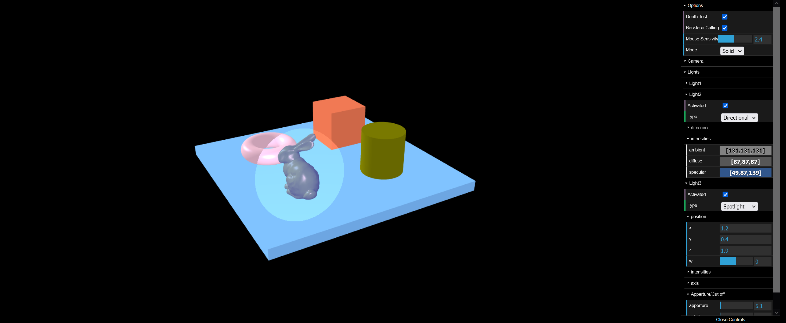

## CGI-P3
CGI university subject project 3
# WebGL Lighting and Materials
(An executable version of the app can be downloaded at branch [BuiltApp_V1](https://github.com/FranciscoJRFreitas/CGI-P3/tree/BuiltApp_V1))
## Introduction
  This project is a WebGL application that showcases different lighting and materials applied to 3D objects. The application allows the user to manipulate the objects, as well as the camera, to explore the effects of different lighting and materials on the objects.

## Features
- Different lighting models (point light, directional light, spot light)
- Material properties (ambient, diffuse, specular)
- Camera movement and zoom
- Object manipulation
- Depth test and backface culling

## Dependencies
- WebGL
- glMatrix
- dat.gui

## Usage
  To use the application, download the project files and open the index.html file in a web browser. The application will load and you can begin exploring the objects and lighting. Use the controls in the top-right corner to manipulate the camera, objects and to adjust the lighting and materials.

## Screenshots

